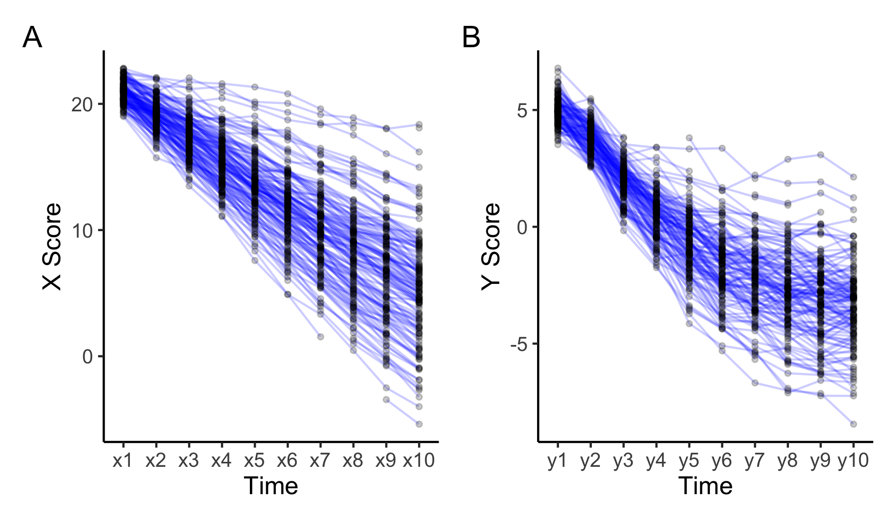
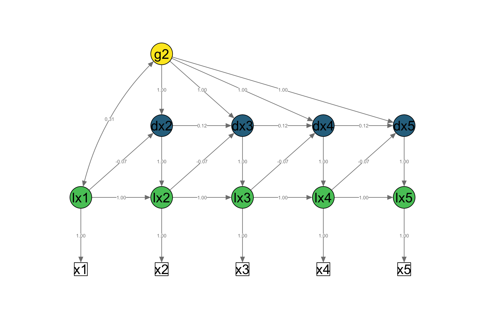

<!-- README.md is generated from README.Rmd. Please edit that file -->

# lcsm: An R package and interactive tutorial on latent change score modeling

[](https://github.com/milanwiedemann/lcsm)
[](https://travis-ci.org/milanwiedemann/lcsm)
[](https://ci.appveyor.com/project/milanwiedemann/lcsm)
[](https://github.com/milanwiedemann/lcsm)

This package contains some helper functions to specify and analyse
univariate and bivariate latent change score (LCS) models using
[lavaan](http://lavaan.ugent.be/) (Rosseel,
[2012](http://www.jstatsoft.org/v48/i02/)) For details about this method
see for example McArdle
([2009](http://www.annualreviews.org/doi/10.1146/annurev.psych.60.110707.163612)),
Ghisletta ([2012](https://doi.org/10.1080/10705511.2012.713275)), Grimm
et al. ([2012](https://doi.org/10.1080/10705511.2012.659627)), and
Grimm, Ram & Estabrook
([2017](https://www.guilford.com/books/Growth-Modeling/Grimm-Ram-Estabrook/9781462526062)).


A shiny application illustrating some functions of this package is available at [here](https://milanwiedemann.shinyapps.io/shinychange/). The main aim is to show how different univariate and bivariate latent change score models (lcsm) can be implemented in R using lavaan syntax. The application also provides data simulation tools to explore the effect of different parameters.

## Installation

You can install the development version from
[GitHub](https://github.com/milanwiedemann/lcsm) with:

``` r
# install.packages("devtools")
devtools::install_github("milanwiedemann/lcsm")
```

## Overview of the functions

The `lcsm` package contains the following functions that can be
categorised into:

  - Functions to specify [lavaan](http://lavaan.ugent.be/) syntax for
    models:
      - `specify_uni_lcsm()`: write syntax for univariate LCSM
      - `specify_bi_lcsm()`: write syntax for bivariate LCSM
  - Functions to fit models using [lavaan](http://lavaan.ugent.be/):
      - `fit_uni_lcsm()`: fit univariate LCSM
      - `fit_bi_lcsm()`: fit bivariate LCSM
  - Functions to extract numbers from models using
    [broom](https://broom.tidyverse.org/):
      - `extract_fit()`: extract fit statistics
      - `extract_param()`: extract estimated parameters
  - Simulate data using [lavaan](http://lavaan.ugent.be/):
      - `sim_uni_lcsm()`: Simulate data from a univariate LCSM
      - `sim_bi_lcsm()`: Simulate data from a bivariate LCSM
  - Helper functions:
      - `plot_lcsm()`: visualise LCSM using
        [semPlot](http://sachaepskamp.com/semPlot)
      - `select_uni_cases()`: select cases for analysis based on
        available scores on one construct
      - `select_bi_cases()`: select cases for analysis based on
        available scores on two construct

## How to use `lcsm`

Here are a few examples how to use the `lcsm` package.

``` r
# Load the package
library(lcsm)
```

### 1\. Visualise data

Longitudinal data can be visualised using the `plot_trajectories()`
function. Here only 30% of the data is visualised using the argument
`random_sample_frac = 0.3`. Only consecutive measures are connected by
lines as specified in `connect_missing = FALSE`.

``` r
# Create plot for construct x
plot_x <- plot_trajectories(data = data_bi_lcsm,
                            id_var = "id", 
                            var_list = c("x1", "x2", "x3", "x4", "x5", 
                                         "x6", "x7", "x8", "x9", "x10"),
                            xlab = "Time", ylab = "X Score",
                            connect_missing = FALSE, 
                            random_sample_frac = 0.3)

# Create plot for construct y
plot_y <- plot_trajectories(data = data_bi_lcsm,
                            id_var = "id", 
                            var_list = c("y1", "y2", "y3", "y4", "y5", 
                                        "y6", "y7", "y8", "y9", "y10"),
                            xlab = "Time", ylab = "Y Score",
                            connect_missing = FALSE, 
                            random_sample_frac = 0.3)

# Arrange plots next to each other using ggpubr::ggarrange()
ggpubr::ggarrange(plot_x,
                  plot_y,
                  labels = c("a", "b"))
#> Warning: Removed 79 rows containing missing values (geom_point).
#> Warning: Removed 13 rows containing missing values (geom_path).
#> Warning: Removed 151 rows containing missing values (geom_point).
#> Warning: Removed 31 rows containing missing values (geom_path).
```



### 2\. Fit LCS models

In a first step the functions `specify_uni_lcsm()` and
`specify_bi_lcsm()` are used to specify the lavaan syntax for a specific
LCS model. The functions `fit_uni_lcsm()` and `fit_bi_lcsm()` are
running specifying the syntax before passing it on to lavaan.

The following table descibes some of the different model specifications
that the `model` arguments can take. More detail can be found in the
help files `help(fit_uni_lcsm)`.

#### 2.1. Fit univariate LCS models

| Model specification | Description                     |
| :------------------ | :------------------------------ |
| alpha\_constant     | Constant change factor          |
| beta                | Proportional change factor      |
| phi                 | Autoregression of change scores |

The example below shows how to specify a generic univariate latent
change score model using the function `specify_uni_lcsm()`. A table of
the description of all parameters that can be estimated is shown
[here](#overview-of-estimated-lcs-model-parameters).

``` r
specify_uni_lcsm(timepoints = 5,
                 var = "x",  
                 change_letter = "g",
                 model = list(alpha_constant = TRUE, 
                              beta = TRUE, 
                              phi = TRUE))
```

<details>

<summary>Click here to see the <code>lavaan</code> syntax specified
above.</summary>

<p>

    # Specify latent true scores 
    lx1 =~ 1 * x1 
    lx2 =~ 1 * x2 
    lx3 =~ 1 * x3 
    lx4 =~ 1 * x4 
    lx5 =~ 1 * x5 
    # Specify mean of latent true scores 
    lx1 ~ gamma_lx1 * 1 
    lx2 ~ 0 * 1 
    lx3 ~ 0 * 1 
    lx4 ~ 0 * 1 
    lx5 ~ 0 * 1 
    # Specify variance of latent true scores 
    lx1 ~~ sigma2_lx1 * lx1 
    lx2 ~~ 0 * lx2 
    lx3 ~~ 0 * lx3 
    lx4 ~~ 0 * lx4 
    lx5 ~~ 0 * lx5 
    # Specify intercept of obseved scores 
    x1 ~ 0 * 1 
    x2 ~ 0 * 1 
    x3 ~ 0 * 1 
    x4 ~ 0 * 1 
    x5 ~ 0 * 1 
    # Specify variance of observed scores 
    x1 ~~ sigma2_ux * x1 
    x2 ~~ sigma2_ux * x2 
    x3 ~~ sigma2_ux * x3 
    x4 ~~ sigma2_ux * x4 
    x5 ~~ sigma2_ux * x5 
    # Specify autoregressions of latent variables 
    lx2 ~ 1 * lx1 
    lx3 ~ 1 * lx2 
    lx4 ~ 1 * lx3 
    lx5 ~ 1 * lx4 
    # Specify latent change scores 
    dx2 =~ 1 * lx2 
    dx3 =~ 1 * lx3 
    dx4 =~ 1 * lx4 
    dx5 =~ 1 * lx5 
    # Specify latent change scores means 
    dx2 ~ 0 * 1 
    dx3 ~ 0 * 1 
    dx4 ~ 0 * 1 
    dx5 ~ 0 * 1 
    # Specify latent change scores variances 
    dx2 ~~ 0 * dx2 
    dx3 ~~ 0 * dx3 
    dx4 ~~ 0 * dx4 
    dx5 ~~ 0 * dx5 
    # Specify constant change factor 
    g2 =~ 1 * dx2 + 1 * dx3 + 1 * dx4 + 1 * dx5 
    # Specify constant change factor mean 
    g2 ~ alpha_g2 * 1 
    # Specify constant change factor variance 
    g2 ~~ sigma2_g2 * g2 
    # Specify constant change factor covariance with the initial true score 
    g2 ~~ sigma_g2lx1 * lx1
    # Specify proportional change component 
    dx2 ~ beta_x * lx1 
    dx3 ~ beta_x * lx2 
    dx4 ~ beta_x * lx3 
    dx5 ~ beta_x * lx4 
    # Specify autoregression of change score 
    dx3 ~ phi_x * dx2 
    dx4 ~ phi_x * dx3 
    dx5 ~ phi_x * dx4 

</p>

</details>

The function `fit_uni_lcsm()` can be used to fit a univariate LCS model
using the sample data set `data_uni_lcsm`. This functions first writes
the lavaan syntax specified in the `model` argument and passes it on to
`lavaaan::lavaan()`.

``` r
# Fit univariate latent change score model
fit_uni_lcsm(data = data_uni_lcsm, 
             var =  c("x1", "x2", "x3", "x4", "x5",
                      "x6", "x7", "x8", "x9", "x10"),
             model = list(alpha_constant = TRUE, 
                          beta = FALSE, 
                          phi = TRUE))
#> lavaan 0.6-5 ended normally after 66 iterations
#> 
#>   Estimator                                         ML
#>   Optimization method                           NLMINB
#>   Number of free parameters                         23
#>   Number of equality constraints                    16
#>   Row rank of the constraints matrix                16
#>                                                       
#>   Number of observations                           500
#>   Number of missing patterns                       273
#>                                                       
#> Model Test User Model:
#>                                               Standard      Robust
#>   Test Statistic                                75.389      74.400
#>   Degrees of freedom                                58          58
#>   P-value (Chi-square)                           0.062       0.072
#>   Scaling correction factor                                  1.013
#>     for the Yuan-Bentler correction (Mplus variant)
```

It is also possible to show the lavaan syntax that was created to fit
the model by the function `specify_uni_lcsm()`. The lavaan syntax
includes comments describing some parts of the syntax in more detail. To
save the syntax in an object the argument `return_lavaan_syntax_string`
has to be set to `TRUE`. This object can be returned in an easy to read
format using `cat(syntax)`, or as a simple string without the `cat()`
function.

``` r
# Fit univariate latent change score model
syntax <- fit_uni_lcsm(data = data_uni_lcsm, 
                       var =  c("x1", "x2", "x3", "x4", "x5",
                                "x6", "x7", "x8", "x9", "x10"),
                       model = list(alpha_constant = TRUE, 
                                    beta = FALSE, 
                                    phi = TRUE),
                      return_lavaan_syntax = TRUE,
                      return_lavaan_syntax_string = TRUE)

# Return lavaan syntax in easy to read format
cat(syntax)
```

<details>

<summary>Click here to see the lavaan syntax specified in
<code>syntax</code>.</summary>

<p>

    # Specify latent true scores 
    lx1 =~ 1 * x1 
    lx2 =~ 1 * x2 
    lx3 =~ 1 * x3 
    lx4 =~ 1 * x4 
    lx5 =~ 1 * x5 
    lx6 =~ 1 * x6 
    lx7 =~ 1 * x7 
    lx8 =~ 1 * x8 
    lx9 =~ 1 * x9 
    lx10 =~ 1 * x10 
    # Specify mean of latent true scores 
    lx1 ~ gamma_lx1 * 1 
    lx2 ~ 0 * 1 
    lx3 ~ 0 * 1 
    lx4 ~ 0 * 1 
    lx5 ~ 0 * 1 
    lx6 ~ 0 * 1 
    lx7 ~ 0 * 1 
    lx8 ~ 0 * 1 
    lx9 ~ 0 * 1 
    lx10 ~ 0 * 1 
    # Specify variance of latent true scores 
    lx1 ~~ sigma2_lx1 * lx1 
    lx2 ~~ 0 * lx2 
    lx3 ~~ 0 * lx3 
    lx4 ~~ 0 * lx4 
    lx5 ~~ 0 * lx5 
    lx6 ~~ 0 * lx6 
    lx7 ~~ 0 * lx7 
    lx8 ~~ 0 * lx8 
    lx9 ~~ 0 * lx9 
    lx10 ~~ 0 * lx10 
    # Specify intercept of obseved scores 
    x1 ~ 0 * 1 
    x2 ~ 0 * 1 
    x3 ~ 0 * 1 
    x4 ~ 0 * 1 
    x5 ~ 0 * 1 
    x6 ~ 0 * 1 
    x7 ~ 0 * 1 
    x8 ~ 0 * 1 
    x9 ~ 0 * 1 
    x10 ~ 0 * 1 
    # Specify variance of observed scores 
    x1 ~~ sigma2_ux * x1 
    x2 ~~ sigma2_ux * x2 
    x3 ~~ sigma2_ux * x3 
    x4 ~~ sigma2_ux * x4 
    x5 ~~ sigma2_ux * x5 
    x6 ~~ sigma2_ux * x6 
    x7 ~~ sigma2_ux * x7 
    x8 ~~ sigma2_ux * x8 
    x9 ~~ sigma2_ux * x9 
    x10 ~~ sigma2_ux * x10 
    # Specify autoregressions of latent variables 
    lx2 ~ 1 * lx1 
    lx3 ~ 1 * lx2 
    lx4 ~ 1 * lx3 
    lx5 ~ 1 * lx4 
    lx6 ~ 1 * lx5 
    lx7 ~ 1 * lx6 
    lx8 ~ 1 * lx7 
    lx9 ~ 1 * lx8 
    lx10 ~ 1 * lx9 
    # Specify latent change scores 
    dx2 =~ 1 * lx2 
    dx3 =~ 1 * lx3 
    dx4 =~ 1 * lx4 
    dx5 =~ 1 * lx5 
    dx6 =~ 1 * lx6 
    dx7 =~ 1 * lx7 
    dx8 =~ 1 * lx8 
    dx9 =~ 1 * lx9 
    dx10 =~ 1 * lx10 
    # Specify latent change scores means 
    dx2 ~ 0 * 1 
    dx3 ~ 0 * 1 
    dx4 ~ 0 * 1 
    dx5 ~ 0 * 1 
    dx6 ~ 0 * 1 
    dx7 ~ 0 * 1 
    dx8 ~ 0 * 1 
    dx9 ~ 0 * 1 
    dx10 ~ 0 * 1 
    # Specify latent change scores variances 
    dx2 ~~ 0 * dx2 
    dx3 ~~ 0 * dx3 
    dx4 ~~ 0 * dx4 
    dx5 ~~ 0 * dx5 
    dx6 ~~ 0 * dx6 
    dx7 ~~ 0 * dx7 
    dx8 ~~ 0 * dx8 
    dx9 ~~ 0 * dx9 
    dx10 ~~ 0 * dx10 
    # Specify constant change factor 
    g2 =~ 1 * dx2 + 1 * dx3 + 1 * dx4 + 1 * dx5 + 1 * dx6 + 1 * dx7 + 1 * dx8 + 1 * dx9 + 1 * dx10 
    # Specify constant change factor mean 
    g2 ~ alpha_g2 * 1 
    # Specify constant change factor variance 
    g2 ~~ sigma2_g2 * g2 
    # Specify constant change factor covariance with the initial true score 
    g2 ~~ sigma_g2lx1 * lx1
    # Specify autoregression of change score 
    dx3 ~ phi_x * dx2 
    dx4 ~ phi_x * dx3 
    dx5 ~ phi_x * dx4 
    dx6 ~ phi_x * dx5 
    dx7 ~ phi_x * dx6 
    dx8 ~ phi_x * dx7 
    dx9 ~ phi_x * dx8 
    dx10 ~ phi_x * dx9 

</p>

</details>

#### 2.2. Fit bivariate LCS models

The function `fit_bi_lcsm()` allowes to specify two univariate LCS
models using the arguments `model_x` and `model_x`. These two constructs
can then be connected using the `coupling` argument. More details can be
found in the help files
`help(fit_bi_lcsm)`.

| Coupling specification   | Description                                           |
| :----------------------- | :---------------------------------------------------- |
| coupling\_piecewise      | Piecewise coupling parameters                         |
| coupling\_piecewise\_num | Changepoint of piecewise coupling parameters          |
| delta\_con\_xy           | Change score x (t) determined by true score y (t)     |
| delta\_con\_yx           | Change score y (t) determined by true score x (t)     |
| delta\_lag\_xy           | Change score x (t) determined by true score y (t-1)   |
| delta\_lag\_yx           | Change score y (t) determined by true score x (t-1)   |
| xi\_con\_xy              | Change score x (t) determined by change score y (t)   |
| xi\_con\_yx              | Change score y (t) determined by change score x (t)   |
| xi\_lag\_xy              | Change score x (t) determined by change score y (t-1) |
| xi\_lag\_yx              | Change score y (t) determined by change score x (t-1) |

``` r
fit_bi_lcsm(data = data_bi_lcsm, 
            var_x = c("x1", "x2", "x3", "x4", "x5",
                      "x6", "x7", "x8", "x9", "x10"),
            var_y = c("y1", "y2", "y3", "y4", "y5", 
                      "y6", "y7", "y8", "y9", "y10"),
            model_x = list(alpha_constant = TRUE, 
                           beta = TRUE, 
                           phi = FALSE),
            model_y = list(alpha_constant = TRUE, 
                           beta = TRUE, 
                           phi = TRUE),
            coupling = list(delta_lag_xy = TRUE, 
                            xi_lag_yx = TRUE))
#> lavaan 0.6-5 ended normally after 118 iterations
#> 
#>   Estimator                                         ML
#>   Optimization method                           NLMINB
#>   Number of free parameters                         87
#>   Number of equality constraints                    65
#>   Row rank of the constraints matrix                65
#>                                                       
#>   Number of observations                           500
#>   Number of missing patterns                       210
#>                                                       
#> Model Test User Model:
#>                                               Standard      Robust
#>   Test Statistic                               191.851     193.021
#>   Degrees of freedom                               208         208
#>   P-value (Chi-square)                           0.782       0.764
#>   Scaling correction factor                                  0.994
#>     for the Yuan-Bentler correction (Mplus variant)
```

### 3\. Extract fit statistics and parmeters

The main underlying functions to extract parameters and fit statistics
come from the `broom` package: `broom::tidy()` and `broom::glance()`.
The functions `extract_param()` and `extract_fit()` offer some tools
that I find helpful when running LCS models in R, for example:

  - `extract_param()`: only one row per estimated parameter,
  - `extract_fit()`: fit statistics for multiple lavaan objects can be
    extracted.

A table of the description of all parameters that can be estimated is
shown [here](#overview-of-estimated-lcs-model-parameters).

``` r
# First create a lavaan object
bi_lcsm_01 <- fit_bi_lcsm(data = data_bi_lcsm, 
                          var_x = c("x1", "x2", "x3", "x4", "x5",
                                    "x6", "x7", "x8", "x9", "x10"),
                          var_y = c("y1", "y2", "y3", "y4", "y5", 
                                    "y6", "y7", "y8", "y9", "y10"),
                          model_x = list(alpha_constant = TRUE, 
                                         beta = TRUE, 
                                         phi = FALSE),
                          model_y = list(alpha_constant = TRUE, 
                                         beta = TRUE, 
                                         phi = TRUE),
                          coupling = list(delta_lag_xy = TRUE, 
                                          xi_lag_yx = TRUE))

# Now extract parameter estimates
# Only extract first 7 columns for this example by adding [ , 1:7]
param_bi_lcsm_01 <- extract_param(bi_lcsm_01)[ , 1:7]

# Print table of parameter estimates
kable(param_bi_lcsm_01, digits = 3)
```

| label          | estimate | std.error | statistic | p.value | conf.low | conf.high |
| :------------- | -------: | --------: | --------: | ------: | -------: | --------: |
| gamma\_lx1     |   21.066 |     0.036 |   588.187 |   0.000 |   20.996 |    21.136 |
| sigma2\_lx1    |    0.493 |     0.037 |    13.485 |   0.000 |    0.421 |     0.564 |
| sigma2\_ux     |    0.201 |     0.004 |    45.301 |   0.000 |    0.192 |     0.210 |
| alpha\_g2      |  \-0.309 |     0.053 |   \-5.834 |   0.000 |  \-0.413 |   \-0.205 |
| sigma2\_g2     |    0.395 |     0.028 |    14.330 |   0.000 |    0.341 |     0.449 |
| sigma\_g2lx1   |    0.155 |     0.022 |     7.017 |   0.000 |    0.112 |     0.198 |
| beta\_x        |  \-0.106 |     0.003 |  \-30.818 |   0.000 |  \-0.113 |   \-0.099 |
| gamma\_ly1     |    5.025 |     0.029 |   172.786 |   0.000 |    4.968 |     5.082 |
| sigma2\_ly1    |    0.208 |     0.019 |    10.860 |   0.000 |    0.171 |     0.246 |
| sigma2\_uy     |    0.193 |     0.005 |    39.698 |   0.000 |    0.183 |     0.202 |
| alpha\_j2      |  \-0.203 |     0.039 |   \-5.217 |   0.000 |  \-0.279 |   \-0.127 |
| sigma2\_j2     |    0.093 |     0.008 |    11.766 |   0.000 |    0.077 |     0.108 |
| sigma\_j2ly1   |    0.017 |     0.008 |     2.156 |   0.031 |    0.002 |     0.032 |
| beta\_y        |  \-0.197 |     0.005 |  \-39.562 |   0.000 |  \-0.207 |   \-0.187 |
| phi\_y         |    0.144 |     0.029 |     4.963 |   0.000 |    0.087 |     0.201 |
| sigma\_su      |    0.009 |     0.003 |     2.581 |   0.010 |    0.002 |     0.015 |
| sigma\_ly1lx1  |    0.185 |     0.021 |     8.905 |   0.000 |    0.144 |     0.225 |
| sigma\_g2ly1   |    0.072 |     0.016 |     4.437 |   0.000 |    0.040 |     0.104 |
| sigma\_j2lx1   |    0.093 |     0.012 |     7.916 |   0.000 |    0.070 |     0.117 |
| sigma\_j2g2    |    0.005 |     0.012 |     0.463 |   0.643 |  \-0.018 |     0.029 |
| delta\_lag\_xy |    0.140 |     0.006 |    23.837 |   0.000 |    0.128 |     0.152 |
| xi\_lag\_yx    |    0.360 |     0.037 |     9.634 |   0.000 |    0.287 |     0.433 |

### 4\. Plot simplified path diagrams of LCS models

This function is work in progress and can only plot univariate and
bivariate LCS models that were specified with `fit_uni_lcsm()` or
`fit_bi_lcsm()`. Modified LCS models will probably return errors as the
layout matrix that gets created by this function only supports some
basic layouts.

``` r
# Fit bivariate lcsm and save the results 
bi_lavaan_results <- fit_bi_lcsm(data = data_bi_lcsm, 
                                 var_x = c("x1", "x2", "x3", "x4", "x5"),
                                 var_y = c("y1", "y2", "y3", "y4", "y5"),
                                 model_x = list(alpha_constant = TRUE, 
                                                beta = TRUE, 
                                                phi = FALSE),
                                 model_y = list(alpha_constant = TRUE, 
                                                beta = TRUE, 
                                                phi = TRUE),
                                 coupling = list(delta_lag_xy = TRUE, 
                                                 xi_lag_yx = TRUE))

# Save the lavaan syntax that was used to create the layout matrix for semPlot
bi_lavaan_syntax <- fit_bi_lcsm(data = data_bi_lcsm, 
                                var_x = c("x1", "x2", "x3", "x4", "x5"),
                                var_y = c("y1", "y2", "y3", "y4", "y5"),
                                model_x = list(alpha_constant = TRUE, 
                                               beta = TRUE, 
                                               phi = FALSE),
                                model_y = list(alpha_constant = TRUE, 
                                               beta = TRUE, 
                                               phi = TRUE),
                                coupling = list(delta_lag_xy = TRUE, 
                                                xi_lag_yx = TRUE),
                                return_lavaan_syntax = TRUE, 
                                return_lavaan_syntax_string = TRUE)

# Plot the results
plot_lcsm(lavaan_object = bi_lavaan_results, 
          lavaan_syntax = bi_lavaan_syntax,
          lcsm = "bivariate")
#> Registered S3 methods overwritten by 'huge':
#>   method    from   
#>   plot.sim  BDgraph
#>   print.sim BDgraph
```



### 5\. Simulate data

The functions `sim_uni_lcsm()` and `sim_bi_lcsm()` simulate data based
on some some parameters that can be specified. See the tables
[here](#overview-of-estimated-lcs-model-parameters) for a full list of
parameters that can be specified for the data simulation.

``` r
# Simulate some data 
sim_uni_lcsm(timepoints = 5, 
             model = list(alpha_constant = TRUE, beta = FALSE, phi = TRUE), 
             model_param = list(gamma_lx1 = 21, 
                                sigma2_lx1 = 1.5,
                                sigma2_ux = 0.2,
                                alpha_j2 = -0.93,
                                sigma2_j2 = 0.1,
                                sigma_j2lx1 = 0.2,
                                phi_x = 0.3),
             sample.nobs = 1000,
             na_pct = 0.3)
#> Parameter estimates for the data simulation are taken from the argument 'model_param'.
#> Warning: The following parameters are specified in LCS model but no parameter estimates have been entered in 'model_param':
#> -  alpha_g2
#> -  sigma2_g2
#> -  sigma_g2lx1
#> # A tibble: 1,000 x 6
#>       id    x1    x2    x3    x4    x5
#>    <int> <dbl> <dbl> <dbl> <dbl> <dbl>
#>  1     1  19.6  NA    18.7  18.7  18.6
#>  2     2  20.7  21.7  23.9  24.3  26.3
#>  3     3  20.9  NA    19.1  18.0  16.8
#>  4     4  21.6  23.4  NA    24.0  25.4
#>  5     5  21.6  21.9  NA    26.0  NA  
#>  6     6  24.0  24.2  23.7  NA    25.1
#>  7     7  19.4  19.5  NA    17.9  17.2
#>  8     8  NA    21.1  NA    23.0  NA  
#>  9     9  NA    19.8  18.7  17.8  17.5
#> 10    10  19.7  17.6  16.7  15.0  NA  
#> # … with 990 more rows
```

It is also possible to return the lavaan syntax instead of simulating
data for further manual specifications. The modified object could then
be used to simulate data using `lavaan::simulateData()`.

``` r
# Return lavaan syntax based on the following argument specifications
simsyntax <- sim_bi_lcsm(timepoints = 5, 
                         model_x = list(alpha_constant = TRUE, beta = TRUE, phi = FALSE),
                         model_x_param = list(gamma_lx1 = 21,
                                              sigma2_lx1 = .5,
                                              sigma2_ux = .2,
                                              alpha_g2 = -.4,
                                              sigma2_g2 = .4,
                                              sigma_g2lx1 = .2,
                                              beta_x = -.1),
                         model_y = list(alpha_constant = TRUE, beta = TRUE, phi = TRUE),
                         model_y_param = list(gamma_ly1 = 5,
                                              sigma2_ly1 = .2,
                                              sigma2_uy = .2,
                                              alpha_j2 = -.2,
                                              sigma2_j2 = .1,
                                              sigma_j2ly1 = .02,
                                              beta_y = -.2,
                                              phi_y = .1),
                         coupling = list(delta_lag_xy = TRUE, 
                                         xi_lag_yx = TRUE),
                         coupling_param = list(sigma_su = .01,
                                               sigma_ly1lx1 = .2,
                                               sigma_g2ly1 = .1,
                                               sigma_j2lx1 = .1,
                                               sigma_j2g2 = .01,
                                               delta_lag_xy = .13,
                                               xi_lag_yx = .4),
                         return_lavaan_syntax = TRUE)
```

<details>

<summary>Click here to see the lavaan syntax specified in
<code>simsyntax</code>.</summary>

<p>

    # Specify parameters for construct x ----
    # Specify latent true scores 
    lx1 =~ 1 * x1 
    lx2 =~ 1 * x2 
    lx3 =~ 1 * x3 
    lx4 =~ 1 * x4 
    lx5 =~ 1 * x5 
    # Specify mean of latent true scores 
    lx1 ~ 21 * 1 
    lx2 ~ 0 * 1 
    lx3 ~ 0 * 1 
    lx4 ~ 0 * 1 
    lx5 ~ 0 * 1 
    # Specify variance of latent true scores 
    lx1 ~~ 0.5 * lx1 
    lx2 ~~ 0 * lx2 
    lx3 ~~ 0 * lx3 
    lx4 ~~ 0 * lx4 
    lx5 ~~ 0 * lx5 
    # Specify intercept of obseved scores 
    x1 ~ 0 * 1 
    x2 ~ 0 * 1 
    x3 ~ 0 * 1 
    x4 ~ 0 * 1 
    x5 ~ 0 * 1 
    # Specify variance of observed scores 
    x1 ~~ 0.2 * x1 
    x2 ~~ 0.2 * x2 
    x3 ~~ 0.2 * x3 
    x4 ~~ 0.2 * x4 
    x5 ~~ 0.2 * x5 
    # Specify autoregressions of latent variables 
    lx2 ~ 1 * lx1 
    lx3 ~ 1 * lx2 
    lx4 ~ 1 * lx3 
    lx5 ~ 1 * lx4 
    # Specify latent change scores 
    dx2 =~ 1 * lx2 
    dx3 =~ 1 * lx3 
    dx4 =~ 1 * lx4 
    dx5 =~ 1 * lx5 
    # Specify latent change scores means 
    dx2 ~ 0 * 1 
    dx3 ~ 0 * 1 
    dx4 ~ 0 * 1 
    dx5 ~ 0 * 1 
    # Specify latent change scores variances 
    dx2 ~~ 0 * dx2 
    dx3 ~~ 0 * dx3 
    dx4 ~~ 0 * dx4 
    dx5 ~~ 0 * dx5 
    # Specify constant change factor 
    g2 =~ 1 * dx2 + 1 * dx3 + 1 * dx4 + 1 * dx5 
    # Specify constant change factor mean 
    g2 ~ -0.4 * 1 
    # Specify constant change factor variance 
    g2 ~~ 0.4 * g2 
    # Specify constant change factor covariance with the initial true score 
    g2 ~~ 0.2 * lx1
    # Specify proportional change component 
    dx2 ~ -0.1 * lx1 
    dx3 ~ -0.1 * lx2 
    dx4 ~ -0.1 * lx3 
    dx5 ~ -0.1 * lx4 
    # Specify parameters for construct y ----
    # Specify latent true scores 
    ly1 =~ 1 * y1 
    ly2 =~ 1 * y2 
    ly3 =~ 1 * y3 
    ly4 =~ 1 * y4 
    ly5 =~ 1 * y5 
    # Specify mean of latent true scores 
    ly1 ~ 5 * 1 
    ly2 ~ 0 * 1 
    ly3 ~ 0 * 1 
    ly4 ~ 0 * 1 
    ly5 ~ 0 * 1 
    # Specify variance of latent true scores 
    ly1 ~~ 0.2 * ly1 
    ly2 ~~ 0 * ly2 
    ly3 ~~ 0 * ly3 
    ly4 ~~ 0 * ly4 
    ly5 ~~ 0 * ly5 
    # Specify intercept of obseved scores 
    y1 ~ 0 * 1 
    y2 ~ 0 * 1 
    y3 ~ 0 * 1 
    y4 ~ 0 * 1 
    y5 ~ 0 * 1 
    # Specify variance of observed scores 
    y1 ~~ 0.2 * y1 
    y2 ~~ 0.2 * y2 
    y3 ~~ 0.2 * y3 
    y4 ~~ 0.2 * y4 
    y5 ~~ 0.2 * y5 
    # Specify autoregressions of latent variables 
    ly2 ~ 1 * ly1 
    ly3 ~ 1 * ly2 
    ly4 ~ 1 * ly3 
    ly5 ~ 1 * ly4 
    # Specify latent change scores 
    dy2 =~ 1 * ly2 
    dy3 =~ 1 * ly3 
    dy4 =~ 1 * ly4 
    dy5 =~ 1 * ly5 
    # Specify latent change scores means 
    dy2 ~ 0 * 1 
    dy3 ~ 0 * 1 
    dy4 ~ 0 * 1 
    dy5 ~ 0 * 1 
    # Specify latent change scores variances 
    dy2 ~~ 0 * dy2 
    dy3 ~~ 0 * dy3 
    dy4 ~~ 0 * dy4 
    dy5 ~~ 0 * dy5 
    # Specify constant change factor 
    j2 =~ 1 * dy2 + 1 * dy3 + 1 * dy4 + 1 * dy5 
    # Specify constant change factor mean 
    j2 ~ -0.2 * 1 
    # Specify constant change factor variance 
    j2 ~~ 0.1 * j2 
    # Specify constant change factor covariance with the initial true score 
    j2 ~~ 0.02 * ly1
    # Specify proportional change component 
    dy2 ~ -0.2 * ly1 
    dy3 ~ -0.2 * ly2 
    dy4 ~ -0.2 * ly3 
    dy5 ~ -0.2 * ly4 
    # Specify autoregression of change score 
    dy3 ~ 0.1 * dy2 
    dy4 ~ 0.1 * dy3 
    dy5 ~ 0.1 * dy4 
    # Specify residual covariances 
    x1 ~~ 0.01 * y1 
    x2 ~~ 0.01 * y2 
    x3 ~~ 0.01 * y3 
    x4 ~~ 0.01 * y4 
    x5 ~~ 0.01 * y5 
    # Specify covariances betweeen specified change components (alpha) and intercepts (initial latent true scores lx1 and ly1) ----
    # Specify covariance of intercepts 
    lx1 ~~ 0.2 * ly1 
    # Specify covariance of constant change and intercept within the same construct 
    ly1 ~~ 0.1 * g2 
    # Specify covariance of constant change and intercept within the same construct 
    lx1 ~~ 0.1 * j2 
    # Specify covariance of constant change factors between constructs 
    g2 ~~ 0.01 * j2 
    # Specify between-construct coupling parameters ----
    # Change score x (t) is determined by true score y (t-1)  
    dx2 ~ 0.13 * ly1 
    dx3 ~ 0.13 * ly2 
    dx4 ~ 0.13 * ly3 
    dx5 ~ 0.13 * ly4 
    # Change score y (t) is determined by change score x (t-1)  
    dy3 ~ 0.4 * dx2 
    dy4 ~ 0.4 * dx3 
    dy5 ~ 0.4 * dx4 

</p>

</details>

## Overview of estimated LCS model parameters

### Univariate LCS models

Depending on the specified model, the following parameters can be
estimated for **univariate** LCS
models:

| Parameter    | Description                                                    |
| :----------- | :------------------------------------------------------------- |
| gamma\_lx1   | Mean of latent true scores x (Intercept)                       |
| sigma2\_lx1  | Variance of latent true scores x                               |
| sigma2\_ux   | Variance of observed scores x                                  |
| alpha\_g2    | Mean of change factor (g2)                                     |
| alpha\_g3    | Mean of change factor (g3)                                     |
| sigma2\_g2   | Variance of change factor (g2)                                 |
| sigma2\_g3   | Variance of change factor (g3)                                 |
| sigma\_g2lx1 | Covariance of change factor (g2) with the initial true score x |
| sigma\_g3lx1 | Covariance of change factor (g3) with the initial true score x |
| sigma\_g2g3  | Covariance of change factors within construct x                |
| phi\_x       | Autoregression of change scores x                              |

### Bivariate LCS models

For bivariate LCS models, estimated parameters can be categorised into
(1) **Construct X**, (2) **Construct Y**, and (3) **Coupling between X
and
Y**.

| Parameter           | Description                                                            |
| :------------------ | :--------------------------------------------------------------------- |
| **Construct X**     |                                                                        |
| gamma\_lx1          | Mean of latent true scores x (Intercept)                               |
| sigma2\_lx1         | Variance of latent true scores x                                       |
| sigma2\_ux          | Variance of observed scores x                                          |
| alpha\_g2           | Mean of change factor (g2)                                             |
| alpha\_g3           | Mean of change factor (g3)                                             |
| sigma2\_g2          | Variance of change factor (g2)                                         |
| sigma2\_g3          | Variance of change factor (g3)                                         |
| sigma\_g2lx1        | Covariance of change factor (g2) with the initial true score x (lx1)   |
| sigma\_g3lx1        | Covariance of change factor (g3) with the initial true score x (lx1)   |
| sigma\_g2g3         | Covariance of change factors within construct x                        |
| phi\_x              | Autoregression of change scores x                                      |
| **Construct Y**     |                                                                        |
| gamma\_ly1          | Mean of latent true scores y (Intercept)                               |
| sigma2\_ly1         | Variance of latent true scores y                                       |
| sigma2\_uy          | Variance of observed scores y                                          |
| alpha\_j2           | Mean of change factor (j2)                                             |
| alpha\_j3           | Mean of change factor (j3)                                             |
| sigma2\_j2          | Variance of change factor (j2)                                         |
| sigma2\_j3          | Variance of change factor (j3)                                         |
| sigma\_j2ly1        | Covariance of change factor (j2) with the initial true score y (ly1)   |
| sigma\_j3ly1        | Covariance of change factor (j3) with the initial true score y (ly1)   |
| sigma\_j2j3         | Covariance of change factors within construct y                        |
| phi\_y              | Autoregression of change scores y                                      |
| **Coupeling X & Y** |                                                                        |
| sigma\_su           | Covariance of residuals x and y                                        |
| sigma\_ly1lx1       | Covariance of intercepts x and y                                       |
| sigma\_g2ly1        | Covariance of change factor x (g2) with the initial true score y (ly1) |
| sigma\_g3ly1        | Covariance of change factor x (g3) with the initial true score y (ly1) |
| sigma\_j2lx1        | Covariance of change factor y (j2) with the initial true score x (lx1) |
| sigma\_j3lx1        | Covariance of change factor y (j3) with the initial true score x (lx1) |
| sigma\_j2g2         | Covariance of change factors y (j2) and x (g2)                         |
| sigma\_j2g3         | Covariance of change factors y (j2) and x (g3)                         |
| sigma\_j3g2         | Covariance of change factors y (j3) and x (g2)                         |
| delta\_con\_xy      | Change score x (t) determined by true score y (t)                      |
| delta\_con\_yx      | Change score y (t) determined by true score x (t)                      |
| delta\_lag\_xy      | Change score x (t) determined by true score y (t-1)                    |
| delta\_lag\_yx      | Change score y (t) determined by true score x (t-1)                    |
| xi\_con\_xy         | Change score x (t) determined by change score y (t)                    |
| xi\_con\_yx         | Change score y (t) determined by change score x (t)                    |
| xi\_lag\_xy         | Change score x (t) determined by change score y (t-1)                  |
| xi\_lag\_yx         | Change score y (t) determined by change score x (t-1)                  |
