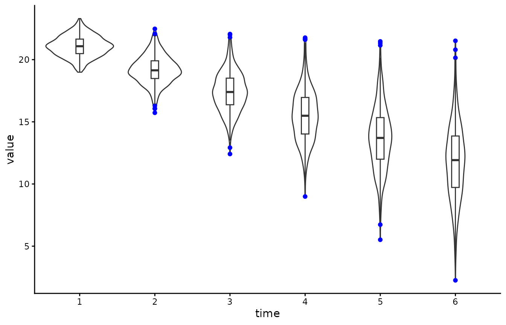
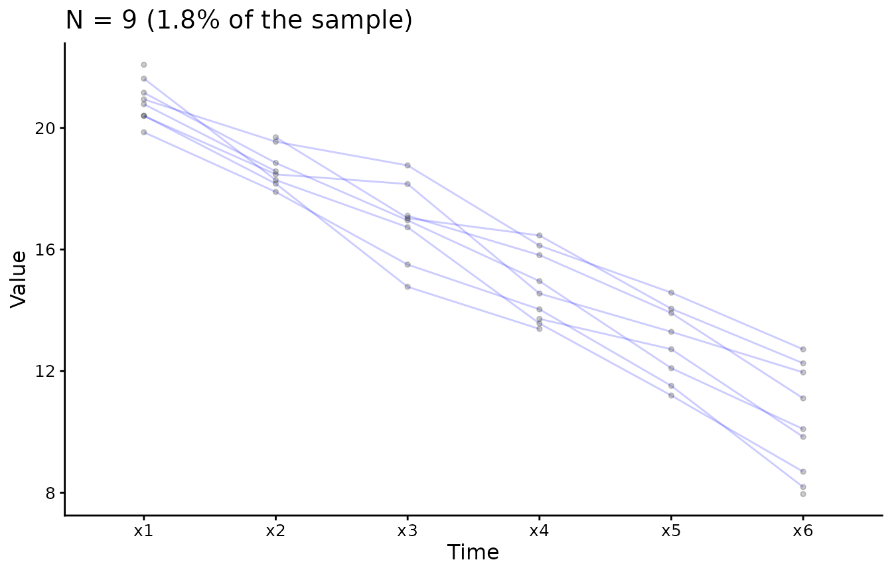
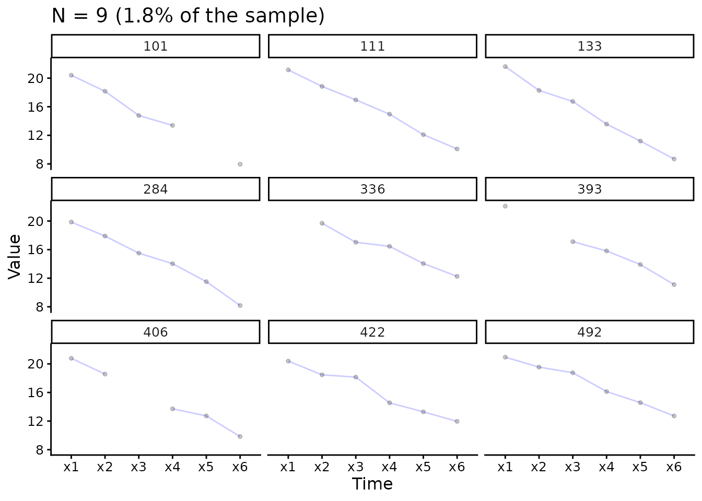

# Visualise longitudinal data

``` r

# Load packages
library(lcsm)
library(ggplot2)
library(tidyr)
library(dplyr)
library(stringr)
```

It’s important to understand the data. For longitudinal analyses it may
be helpful visualise the individual trajectories. A more detailed
overview of the rational behind this be found in Ghisletta and McArdle
([2012](#ref-Ghisletta2012)) or Chapter 2 in Grimm et al.
([2017](#ref-Grimm2017)). Most basic (and advanced) plots can be done
relatively easily using already existing R packages. THe plotting
functions of the `lcsm` package actually build on function from other
packages. I’ll show some examples illustrating how to visualise
longitudinal data using the R package `ggplot2` ([Wickham
2016](#ref-R-ggplot2)). The function
[`plot_trajectories()`](https://milanwiedemann.github.io/lcsm/reference/plot_trajectories.md)
of the `lcsm` R package builds on `ggplot2` to make it a little easier
to visualize individual trajectories.

I’ll show how to visualise 6 repeated measurements from the data set
`data_bi_lcsm` from this package.

## Prepare data

When working with repeated measures I like to create a vector of the
variables so I don’t have to type the names again and again, but this
really needed and everything would also work without doing this.

``` r

# Create a vector of variable names
x_var_list <- c("x1", "x2", "x3", "x4", "x5", "x6")

# Or simply use the paste function and R might work too
paste0("x", 1:6)
#> [1] "x1" "x2" "x3" "x4" "x5" "x6"
```

The repeated measurements need to be in “long” format when using
`ggplot2` for plotting. Note that this is different to the data
structure needed for `lavaan`, so the same data can’t just be used for
plotting without restructuring - `lavaan` expects the data to be in
“wide” format.

I’ll show how to transform the data anyway because the plotting function
[`plot_trajectories()`](https://milanwiedemann.github.io/lcsm/reference/plot_trajectories.md)
is limited and other plots may be more appropriate. Fortunately, this is
a relatively straightforward to do, my favourite function to do this is
[`pivot_longer()`](https://tidyr.tidyverse.org/reference/pivot_longer.html)
from the `tidyr` package. Next, to get the correct order of repeated
measures the time variable needs to be ordered in the correct order. R
know how to order numbers but only if the variable is actually numeric.
If you’re using variable names that also include letters R might get
confused and get the order wrong. Imagine you have four repeated
measurements, week 1 to 3 and week 10 and the following variable names:
`w1`, `w2`, `w3`, `w10`. R will get this order wrong and thinks that
`w1` is followed by `w10` and then `w2` and `w3`. To avoid this there
are a couple options, I usually do one of the two:

1.  Create a factor with the original variable names using the in build
    [`factor()`](https://rdrr.io/r/base/factor.html) function from base
    R
2.  Extracting the number from the string and then creating a factor
    (see example below)

``` r

# Create long data set
data_long <- data_bi_lcsm %>% 
  select("id", all_of(x_var_list)) %>% 
  # Pivot data long
  pivot_longer(cols = all_of(x_var_list), names_to = "time", values_to = "value") %>% 
  mutate(
    # Extract number from time variable
    time = str_extract(time, "\\d+"),
    # At the moment the numbers in the time are 'characters'
    # So here it gets transformed to a numeric value
    time = factor(as.numeric(time))
    )
```

These data manipulations are necessary for plotting longitudinal data in
R and the
[`plot_trajectories()`](https://milanwiedemann.github.io/lcsm/reference/plot_trajectories.md)
function from this package is doing this transformation automatically in
the background.

## Violin plots

``` r

# Create violin plot  with outliers in colour blue
# Also add boxplot
ggplot(data_long, aes(time, value)) +
  geom_violin() +
  geom_boxplot(width = 0.1, outlier.colour = "blue") +
  theme_classic()
#> Warning: Removed 154 rows containing non-finite outside the scale range
#> (`stat_ydensity()`).
#> Warning: Removed 154 rows containing non-finite outside the scale range
#> (`stat_boxplot()`).
```



Similar visualisations that communicate the data in a more open way have
been developed for example by Allen et al. ([2019](#ref-Allen2019)) and
Langen ([2020](#ref-vanLangen2020)).

## Longitudinal plots

While the violin plot focuses on more on the overall distribution, the
following plots highlight the individual trajectories for each case in
the data. Longitudinal data can be visualised using the
[`plot_trajectories()`](https://milanwiedemann.github.io/lcsm/reference/plot_trajectories.md)
function from the `lcsm` package. Here only 1.8% of the data is
visualised using the argument `random_sample_frac = 0.018`. Only
consecutive measures are connected by lines as specified in
`connect_missing = FALSE`.

### Overlaid individual trajectories

``` r

# Create longitudinal plot for construct x
# Select ransom 1.8% of the sample
plot_trajectories(data = data_bi_lcsm,
                  id_var = "id", 
                  var_list = x_var_list,
                  xlab = "Time", ylab = "Value",
                  connect_missing = FALSE, 
                  random_sample_frac = 0.018, 
                  title_n = TRUE)
#> Warning: Removed 1 row containing missing values or values outside the scale range
#> (`geom_line()`).
#> Warning: Removed 4 rows containing missing values or values outside the scale range
#> (`geom_point()`).
```



### Separate individual trajectories

``` r

# Create plot for construct x
# Add facet_wrap() function from ggplot2
plot_trajectories(data = data_bi_lcsm,
                  id_var = "id", 
                  var_list = x_var_list,
                  xlab = "Time", ylab = "Value",
                  connect_missing = F, 
                  random_sample_frac = 0.018, 
                  title_n = T) +
  facet_wrap(~id)
#> Warning: Removed 1 row containing missing values or values outside the scale range
#> (`geom_line()`).
#> Warning: Removed 4 rows containing missing values or values outside the scale range
#> (`geom_point()`).
```



## References

Allen, Micah, Davide Poggiali, Kirstie Whitaker, Tom Rhys Marshall, and
Rogier A. Kievit. 2019. “Raincloud Plots: A Multi-Platform Tool for
Robust Data Visualization.” *Wellcome Open Research* 4 (April): 63.
<https://doi.org/10.12688/wellcomeopenres.15191.1>.

Ghisletta, Paolo, and John J. McArdle. 2012. “Latent Curve Models and
Latent Change Score Models Estimated in R.” *Structural Equation
Modeling: A Multidisciplinary Journal* 19 (4): 651–82.
<https://doi.org/10.1080/10705511.2012.713275>.

Grimm, Kevin J., Nilam Ram, and Ryne Estabrook. 2017. *Growth Modeling -
Structural Equation and Multilevel Modeling Approaches*. The Guilford
Press.

Langen, J. van. 2020. *Open-Visualizations in R and Python*.
https://doi.org/<https://doi.org/10.5281/zenodo.3715576>.

Wickham, Hadley. 2016. *Ggplot2: Elegant Graphics for Data Analysis*.
Springer-Verlag New York. <https://ggplot2.tidyverse.org>.
